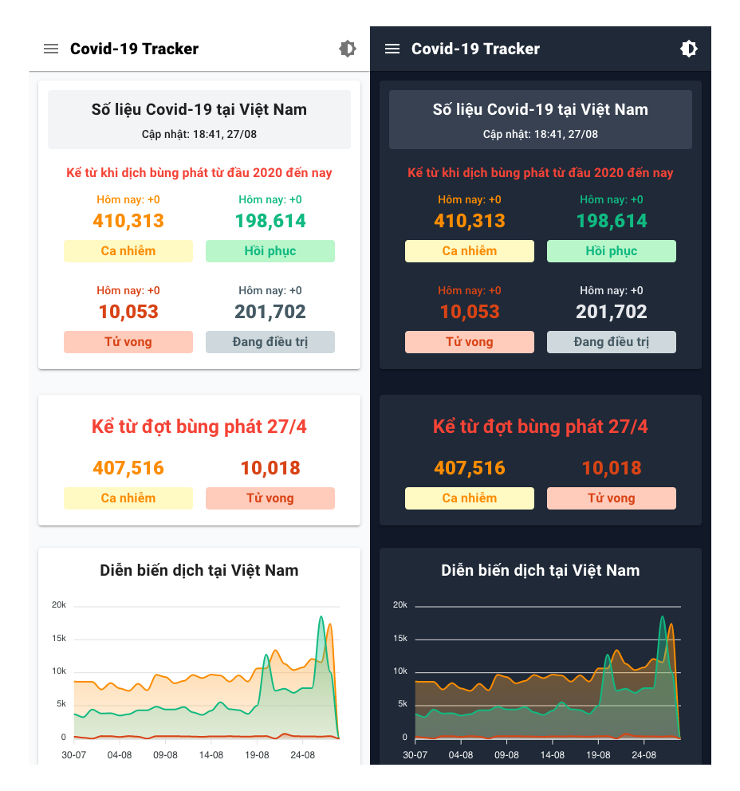

# Covid-19 Tracker

<p align="center">
  
</p>

## Overview

Web application to monitor the developments of the Covid-19 epidemic in Vietnam.

<p align="center">
  
</p>

## Features.

- Track the number of confirmed cases, deaths, recovered and being treated.
- Make a daily epidemic chart.
- Monitor epidemic developments in each province.
- Monitor vaccination progress.
- Summary of some reliable articles.
- Light/dark mode switch.

## Technologies

- [Nuxt.js](https://github.com/nuxt/nuxt.js)
- [Vuetify](https://github.com/vuetifyjs/vuetify)
- [Apexcharts](https://github.com/apexcharts/vue-apexcharts)

## Install

```
  $ git clone
  $ yarn install
  $ yarn build
  $ yarn start
```

## Data sources

- [Ministry of Health (Vietnam)](https://moh.gov.vn/)
- [Kompa](https://kompa.ai/)
- [VnExpress](https://vnexpress.net/)
- [Zing News](https://zingnews.vn/)

## Demo

- [Website](https://nkov.tk/)

## License

- [MIT](./LICENSE)
